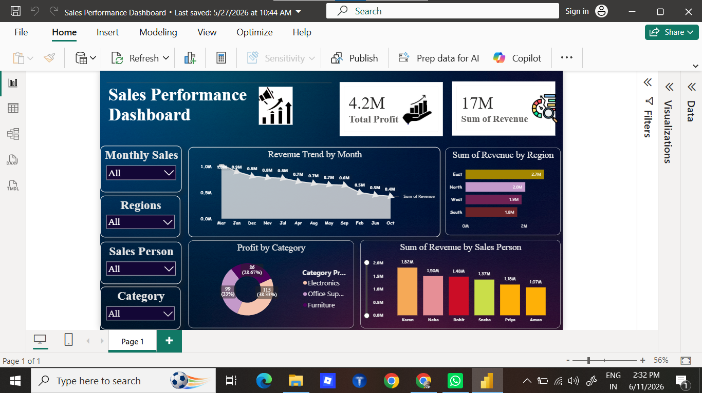

# Sales Performance Dashboard - Power BI

### 📊 Project Overview
Analyzed Superstore Sales data of **₹17M+ revenue** to identify profit drivers and regional trends using Power BI. Created interactive dashboards with DAX measures for business insights.

### 🔑 Key Insights
- **Total Revenue:** ₹17M | **Total Profit:** ₹4.2M | **Profit Margin:** 24.6%
- **Top Region:** East with ₹2.7M revenue 
- **Best Category:** Electronics contributing 38.3% of total profit
- **Top Sales Person:** Karan with ₹1.62M revenue

### 🛠️ Tools & Skills Used
`Power BI` `DAX` `Data Modeling` `Data Visualization` `KPI Cards` `Slicers` `Power Query`

### 📸 Dashboard Preview

### 📁 Files
- `Sales Performance Dashboard.pbix` - Download to interact with the dashboard

### 🚀 How to Use
1. Download the `.pbix` file
2. Open with Power BI Desktop
3. Use slicers to filter by Region, Category, Sales Person

### 👩‍💻 Author
**Shreya Pandey** | Aspiring Data Analyst  
[LinkedIn](https://www.linkedin.com/in/shreya-pandey-083a5b327) | [Email](mailto:shreya.learner055@gmail.com)
